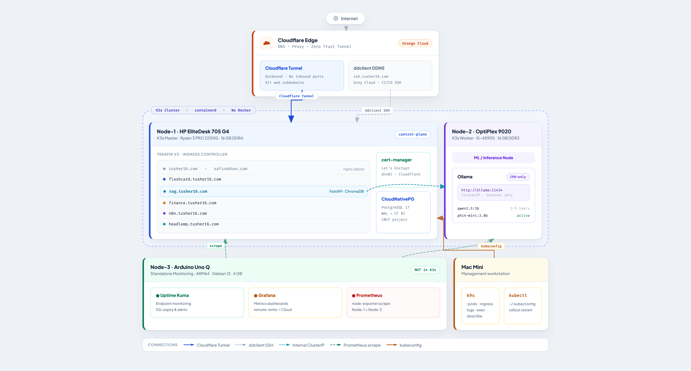
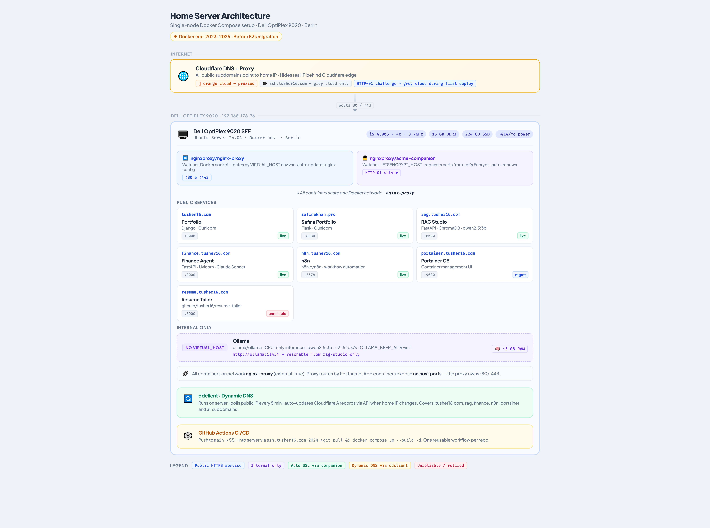

# tusher16/homelab

Personal home server infrastructure — Berlin, Germany.

This repo documents the migration from a single Docker Compose server to a K3s-based homelab. The public repo contains architecture docs, sanitized manifests, runbooks, and legacy Docker-era setup files. Secrets, real IPs, kubeconfig, and tokens belong in the private `homelab-private` repo.

---

## Architecture

### Current Target: K3s Homelab



### Legacy: Docker Compose Era



---

## The Hardware

| Node | Machine | Role |
|---|---|---|
| Node-1 | HP EliteDesk 705 G4 | K3s Master |
| Node-2 | Dell OptiPlex 9020 | K3s Worker (Ollama/ML) |
| Node-3 | Arduino Uno Q | Monitoring (standalone) |

Both x86 machines were bought second-hand on Kleinanzeigen for around €80 each.

---

## Repo Structure

```
homelab/
├── legacy/                  ← Docker Compose era (2023–2025)
│   ├── proxy/               ← nginx-proxy + acme-companion setup
│   ├── services/            ← docker-compose.yml per service
│   ├── ddclient.conf.example
│   └── .github/workflows/   ← CI/CD deploy workflow
│
├── cluster/                 ← K3s bootstrap (current)
├── apps/                    ← K3s manifests per service (current)
├── monitoring/              ← Node-3 standalone stack
└── docs/
    ├── master-plan.md       ← sanitized migration master plan
    ├── articles/            ← blog/article drafts
    ├── legacy/              ← Docker era architecture docs
    ├── adr/                 ← Architecture Decision Records
    └── runbooks/
```

---

## Two Eras

### Era 1 — Docker Compose (2023–2025)
One machine. nginx-proxy routes by hostname. Let's Encrypt via companion container.
All config lives in `legacy/`. Read the full story: [Medium article →](https://medium.com/@tusher16/self-hosting-my-portfolio-stack-docker-cloudflare-and-a-80-refurbished-desktop-866081e5931f)

### Era 2 — K3s Cluster (2026–present)
Two-node K3s cluster. Traefik replaces nginx-proxy. cert-manager replaces the Let's Encrypt companion.
All config lives in `cluster/` and `apps/`.

---

## Current Status

| Area | Status |
|---|---|
| Phase 0 — Network | Done |
| Phase 1 — K3s master on Node-1 | Done |
| Phase 2 — Traefik + cert-manager | Done |
| Phase 3 — static landing pages | Done |
| FlashDeutsch | Done |
| Phase 4 — migrate RAG Studio, finance-agent, n8n | Next |
| Node-2 K3s worker + Ollama pod | Planned |
| CloudNativePG | Planned |

Known correction: the Node-1 hostname used in Kubernetes manifests is `elitedesk-node1`.

---

## Quick Start (Docker era — single old PC)

If you want to replicate the Docker setup on your own machine:

```bash
# 1. Clone this repo
git clone https://github.com/tusher16/homelab.git
cd homelab/legacy

# 2. Start the proxy (do this once, before any services)
cd proxy
docker compose up -d

# 3. Create the shared network if it doesn't exist yet
docker network create nginx-proxy

# 4. Deploy any service
cd ../services/template
cp .env.example .env
nano .env   # fill in your values
docker compose up --build -d
```

Full step-by-step guide in [`docs/legacy/README.md`](docs/legacy/README.md).

---

## Related Repos

| Repo | What |
|---|---|
| [tusher16/rag-studio](https://github.com/tusher16/rag-studio) | RAG pipeline — FastAPI + ChromaDB + Ollama |
| [tusher16/family-finance-agent](https://github.com/tusher16/family-finance-agent) | AI finance tool — FastAPI + Claude Sonnet |
| [tusher16/rag-from-scratch](https://github.com/tusher16/rag-from-scratch) | Original RAG research repo |

---

*Berlin, Germany · Docker era since 2023 · K3s migration since May 2026*
