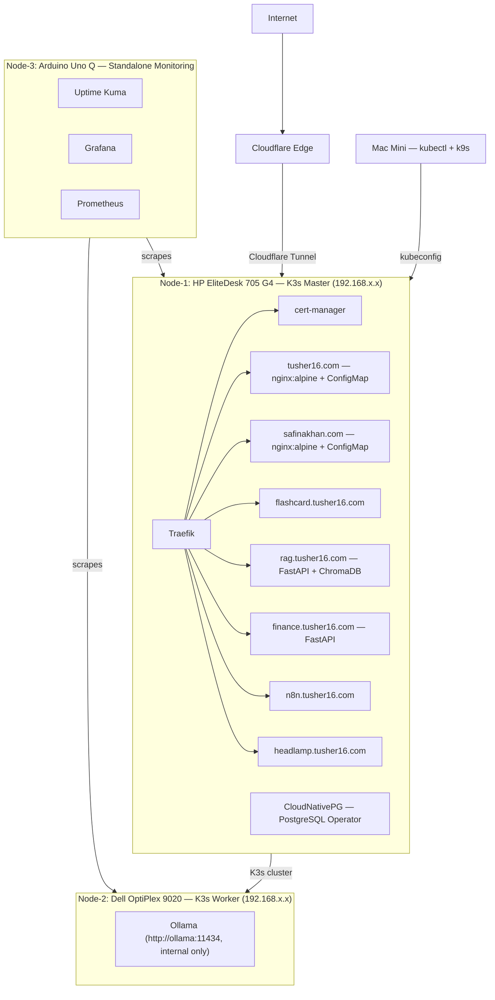

# I Migrated My Home Server to a Three-Node K3s Cluster. This Is the Architecture.

### From a single Docker Compose machine to a distributed Kubernetes setup running AI workloads, production databases, and automated SSL on refurbished hardware in Berlin.

---

For about two years, I ran everything on a single Dell OptiPlex 9020 sitting on my desk in Berlin. One machine, Docker Compose, `jwilder/nginx-proxy` for routing, a Let's Encrypt companion container for SSL. It worked fine.

Then I wanted to add Ollama for local LLM inference. Then a RAG pipeline. Then a family finance app backed by a real database. The machine had 16GB of DDR3 RAM and an i5-4590S from 2014. At some point, I stopped being able to add things without breaking other things, and I had no way to roll back or observe what was actually happening.

The real problem was not the hardware. It was that Docker Compose does not give you a recovery model. There are no health checks that reschedule failing containers. There is no concept of resource limits per service. When something OOMs at 2am, you find out from a friend who tries to visit your portfolio.

In this post, I'll walk through the architecture I built to replace that setup: a three-node K3s cluster on refurbished hardware, running production-grade tooling at a total hardware cost under €250. I'll cover the networking strategy, the node responsibilities, the database setup with CloudNativePG, and the observability stack that runs on a small ARM board so it stays independent of the cluster it monitors.

---

## The hardware

Before getting into software, here are the three machines.

**Node-1 (K3s master): HP EliteDesk 705 G4 SFF**
This is the control plane and hosts all web-facing workloads. AMD Ryzen 3 PRO 2200G, 16GB DDR4, 256GB SSD. I bought it secondhand from Kleinanzeigen for around €80. The listing said Ryzen 5. It was a Ryzen 3. Worth verifying with `lscpu` before you commit to a spec in your runbook.

**Node-2 (K3s worker): Dell OptiPlex 9020**
Dedicated to Ollama and ML workloads. Intel i5-4590S, 16GB DDR3, 224GB SSD. This was the original server. Rather than throwing it away, I wiped it, installed Ubuntu Server 24.04 LTS, and joined it to the cluster as a worker. With 16GB DDR3 and a CPU-only Ollama setup, it can run models up to about 7B parameters at Q4 quantization with reasonable speed.

**Node-3 (monitoring): Arduino Uno Q**
A small ARM64 board running Debian 13, 4GB RAM, connected via USB ethernet at 100Mbps. This runs Grafana, Prometheus, and Uptime Kuma completely outside the K3s cluster. The reason for keeping it standalone will make sense when we get to the observability section.

```
Side-by-side:

Node-1: Ryzen 3 PRO 2200G | 16GB DDR4 | x86_64 | Ubuntu 26.04
Node-2: Intel i5-4590S    | 16GB DDR3 | x86_64 | Ubuntu 24.04
Node-3: Cortex-A53        |  4GB      | ARM64  | Debian 13
```

---

## The networking strategy: Cloudflare from the outside, ddclient for one record

My home ISP assigns a dynamic public IP. This creates two problems: the IP changes occasionally, and I do not want it visible to the public internet at all.

Two things address this.

**Cloudflare as the public face.** Every domain I run sits behind Cloudflare's proxy with the orange cloud enabled. When someone hits `rag.tusher16.com`, they reach Cloudflare's edge. Cloudflare forwards the request to my server through an outbound tunnel. My home IP never appears in DNS records, which also means I do not need to worry about IP-based attacks or my ISP changing my address. [1]

**Cloudflare Tunnel for all web traffic.** I run `cloudflared` as a K3s Deployment on Node-1. It opens an outbound connection from inside my cluster to Cloudflare's network. No inbound ports. No port forwarding rules in the router. This is the setup that makes the orange-cloud proxy work without port 80 or 443 being open at the router level.

```
[Insert Cloudflare Tunnel Deployment YAML here]
```

**ddclient for exactly one record.** I still run `ddclient` on Node-1, but only to keep `ssh.tusher16.com` updated. That subdomain uses a grey cloud DNS record (not proxied) and points directly to my home IP. GitHub Actions needs a real TCP connection to port <SSH_PORT> for CI/CD SSH deployments. Cloudflare Tunnel does not support SSH over its free tier. So that one record stays as a plain A record, updated automatically whenever my IP changes.

```conf
# /etc/ddclient.conf (minimal version)
daemon=300
syslog=yes
use=web, web=https://api.ipify.org
protocol=cloudflare
zone=tusher16.com
login=tusher16@gmail.com
password=<cloudflare-api-token>
ssh.tusher16.com
```

Everything else (all web subdomains) goes through the tunnel and does not need ddclient at all.

---

## The full architecture



*Figure 1: Full homelab architecture. External traffic enters through Cloudflare Tunnel. Node-3 monitors both K3s nodes independently.*

---

## Node-1: the control plane and all web workloads

Node-1 runs the K3s control plane, Traefik as the ingress controller, cert-manager for SSL automation, and every public-facing application. It also hosts the PostgreSQL operator.

### Traefik replaces jwilder/nginx-proxy

The old setup used `jwilder/nginx-proxy`, which watches the Docker socket and routes traffic by reading `VIRTUAL_HOST` environment variables on containers. It works, but it is tied to Docker. Moving to Kubernetes means moving to a Kubernetes-native ingress controller.

K3s ships Traefik by default. From K3s v1.32 onward, it ships Traefik v3. There is nothing to install. When K3s starts, Traefik is already running in `kube-system`. [2]

The routing model changes from environment variables to Ingress YAML resources. Each service gets a 10-15 line file that declares the hostname, the backend service, and the TLS configuration. That file lives in Git. When the cluster is wiped and rebuilt, the routing comes back automatically.

```yaml
[Insert Traefik Ingress YAML here]
# Pattern: cert-manager.io/cluster-issuer: "letsencrypt-prod"
# ingressClassName: traefik
# spec.tls.secretName: <service>-tls
```

One important constraint: never edit `traefik.yaml` directly in K3s. K3s overwrites it on every restart. All Traefik customisations go through a `HelmChartConfig` CRD. [2]

```yaml
[Insert HelmChartConfig YAML here]
# Covers: HTTP to HTTPS redirect, Cloudflare trusted IP ranges for real visitor IPs
```

### cert-manager handles SSL, forever

cert-manager watches certificates, checks expiration daily, and renews anything within 30 days of expiry. Once it is configured, I have not thought about SSL since.

There is one critical detail when using cert-manager behind Cloudflare's orange cloud. The `http01` ACME solver does not work. Cloudflare's proxy intercepts the HTTP challenge before it reaches the server, and Let's Encrypt gets back an error. The certificate appears to be issued on day one, but renewals fail silently at day 60. This is confirmed in cert-manager GitHub issue #6471. [3]

The fix is the `dns01` solver, which validates ownership by creating a temporary TXT record in Cloudflare DNS through the API rather than over HTTP. The orange cloud stays on. Renewals work correctly.

```yaml
[Insert ClusterIssuer YAML with dns01/Cloudflare solver here]
```

### Static sites from ConfigMaps

Two portfolio sites (`tusher16.com` and `safinakhan.com`) are static pages. For these, I use a ConfigMap that holds the entire HTML file, mounted as a volume into a stock `nginx:1.27-alpine` container. No custom Docker image. The entire deployment is a YAML file in Git. Changing the page content means editing the ConfigMap and running `kubectl apply`.

```yaml
[Insert ConfigMap + Deployment + Service + Ingress for static site here]
```

### CloudNativePG: PostgreSQL as a Kubernetes-native operator

The cluster runs CloudNativePG (CNPG) as the database layer for all applications. CNPG is a CNCF-listed project that manages PostgreSQL clusters inside Kubernetes. Rather than running a vanilla Postgres container in a Deployment, CNPG gives you a `Cluster` CRD and a `Database` CRD. [4]

The `Cluster` resource defines the PostgreSQL instance, including storage class, node affinity (pinned to Node-1 in my case), and backup configuration. Backup goes to Cloudflare R2 via S3-compatible API, with WAL streaming enabled. The `Database` resource creates individual databases declaratively:

```yaml
[Insert CloudNativePG Database CRD YAML here]
# Creates: tusher_portfolio, safina_portfolio, finance_agent databases
# All managed by the operator, no kubectl exec required
```

One important operational note: never create databases inside CNPG using `kubectl exec` and a `psql` command. Use the `Database` CRD. It keeps your database state in Git, and the operator reconciles it if the pod is rescheduled. The CNPG v1.25 docs are explicit about this. [4]

I am running CNPG 1.29.1. If you are considering an older version, check the CVE list first. A critical vulnerability (CVSS 9.4) was disclosed in May 2026 affecting all versions before 1.28.3.

---

## Node-2: dedicated to Ollama

Node-2 runs one thing: Ollama. It is a K3s worker node, joined to the cluster, with a `nodeSelector` that pins the Ollama pod to `optiplex-worker`. No other workloads run on this node.

```yaml
[Insert Ollama Deployment YAML here]
# nodeSelector: kubernetes.io/hostname: optiplex-worker
# OLLAMA_KEEP_ALIVE: "-1" to prevent model unloading
# resources: limits.memory: 14Gi, limits.cpu: "4"
```

Inside the cluster, other pods reach Ollama at `http://ollama:11434`. It is not exposed to the internet. RAG Studio passes queries to this internal endpoint during inference.

Because Node-2 is a K3s worker rather than a separate machine, I can shut it down when I am not running inference workloads. The procedure is `kubectl drain optiplex-worker --ignore-daemonsets` before powering off. This saves roughly €14/month in electricity compared to running both nodes 24/7 at Berlin power prices. Pulling power without draining first causes the control plane to spend 5 to 15 minutes marking the node as `NotReady` and firing alerts.

When CPU-only inference is your constraint, model selection matters. On a 16GB DDR3 machine, qwen2.5:3b runs at around 2 to 5 tokens per second, which is usable for async tasks. Anything above 7B at Q4 quantization fills the RAM. Phi-4 Mini at 3.8B offers better quality per token than qwen2.5:3b for most query types.

---

## Observability: why the monitoring node is not in the cluster

Node-3 (Arduino Uno Q, ARM64, 4GB RAM) runs Grafana, Prometheus, and Uptime Kuma as standalone Docker containers, not K3s pods.

If Node-1 goes down, a monitoring stack running inside the K3s cluster also goes down. You lose visibility at the exact moment you need it most. Node-3 is a separate machine on the same local network. It scrapes metrics from both K3s nodes via Prometheus node-exporter and checks public endpoint availability via Uptime Kuma. If the cluster is completely offline, Node-3 still reports the outage.

```yaml
[Insert Prometheus scrape config for Node-1 and Node-2 here]
# scrape_configs targeting node-exporter on both nodes
```

One practical constraint: the Arduino Uno Q connects via a USB ethernet adapter and gets 100Mbps, not Gigabit. For scraping metrics every 15 seconds across two nodes, this is fine. Running Prometheus with long-term storage on 4GB of RAM is not. Prometheus memory usage scales with active series. A two-node cluster with `kube-state-metrics` and node-exporter easily reaches 1.2 to 1.5GB RSS. That leaves very little headroom.

My plan is to remote-write from a lightweight Prometheus instance on Node-1 to Grafana Cloud (free tier, 10,000 series, 14-day retention). Node-3 then only runs Uptime Kuma, which sits comfortably under 100MB of RAM. That is a much more stable configuration for a 4GB board.

---

## Daily cluster management from the Mac Mini

I manage the cluster from a Mac Mini running `k9s` and `kubectl`. The kubeconfig lives at `~/.kube/config` with the server address pointing to Node-1's LAN IP.

k9s is the primary interface for day-to-day operations. Pressing `:pods` shows the full pod list across all namespaces. `l` tails logs on the selected pod. `e` opens an exec shell. `d` describes the resource with events. For most operations, I do not need to type `kubectl` at all.

For deployments that come through GitHub Actions, the workflow SSHs into Node-1 via `ssh.tusher16.com` (the grey cloud DNS record), then runs `kubectl rollout restart deployment/<name>`. K3s pulls the updated image from the GitHub Container Registry and replaces the pod with zero downtime.

Headlamp at `headlamp.tusher16.com` provides a web UI for the cluster, which is useful for showing the cluster state to someone who does not have kubectl installed. It is protected by Cloudflare Access, so I authenticate via GitHub OAuth before any cluster information is visible.

---

## A real problem I hit

The most frustrating issue during the migration was a NodeSelector mismatch. I wrote the initial landing page YAMLs with `kubernetes.io/hostname: hp-elitedesk` based on what I expected the node name to be. When I applied them, both pods stayed in `Pending` indefinitely. No error message, just `Pending`.

The actual K3s node name was `elitedesk-node1`, set during installation. A `kubectl get nodes` would have shown this immediately, but I wrote the YAML before checking. The fix was a `kubectl patch` to update the nodeSelector. The lesson is to run `kubectl get nodes` before writing any YAML that references a hostname, and to keep a hardware reference doc alongside the cluster configs.

---

## What comes next

Three things are next.

**Flux CD for GitOps.** Right now, deployments go through GitHub Actions SSH. The next step is bootstrapping Flux into the cluster and having it watch the `homelab` Git repository. Every YAML commit becomes a cluster update without SSH. This is how production platform teams deploy, and it is the right direction.

**A third x86 node for HA control plane.** Running a single K3s master means a Node-1 hardware failure takes down every public-facing service. K3s supports embedded etcd HA with three master nodes. Adding a third refurbished machine from Kleinanzeigen would eliminate this single point of failure.

**Full portfolio rebuild.** The landing pages at `tusher16.com` and `safinakhan.com` are static HTML served from ConfigMaps. The plan is to replace them with Django 5 backed by CloudNativePG once the cluster stabilises.

The full architecture, all K3s manifests (sanitised), and ADRs for every major decision are in the public GitHub repository at [github.com/tusher16/homelab](https://github.com/tusher16/homelab).

---

## References

[1] Cloudflare, "How Cloudflare works," Cloudflare Docs, 2025. [Online]. Available: https://developers.cloudflare.com/fundamentals/concepts/how-cloudflare-works/

[2] Rancher, "K3s Server Configuration: Traefik Ingress Controller," k3s.io, 2025. [Online]. Available: https://docs.k3s.io/networking/networking-services#traefik-ingress-controller

[3] cert-manager contributors, "HTTP01 challenges fail behind Cloudflare proxy," cert-manager GitHub Issues, issue #6471, 2023. [Online]. Available: https://github.com/cert-manager/cert-manager/issues/6471

[4] CloudNativePG contributors, "Database CRD — Declarative Database Management," cloudnative-pg.io, 2025. [Online]. Available: https://cloudnative-pg.io/documentation/current/database_crd/
