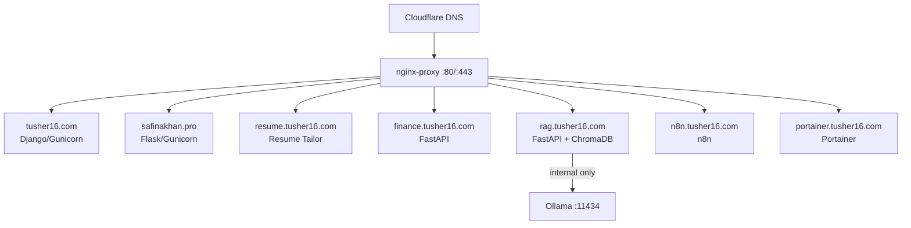

# How I Ran My Entire Portfolio on a Single Second-Hand PC and Docker

In this blog, I'll walk you through how I ran my entire home server on a single Dell OptiPlex 9020 I bought second-hand for around €80. Six live websites, an AI agent, a local LLM, and an automation tool. No cloud bills. No Kubernetes. Just Docker Compose and a bit of patience.

This is the "before" story. Before K3s, before Traefik, before I had two machines to think about. The setup that worked, broke occasionally, and taught me more about production web infrastructure than any tutorial I've read.

---

## Why I did this

I had just finished a few projects I was proud of: a portfolio site, a RAG pipeline, a family finance tool. I wanted them actually live on the internet, not sitting on localhost collecting dust.

The problem was I didn't want to pay €30–40 a month per service on AWS or DigitalOcean. I had a spare OptiPlex sitting on my desk, a home internet connection, and I'd been reading about self-hosting for a while.

So I bought a cheap second-hand SSD, installed Ubuntu Server, opened a couple of ports on my router, and started deploying things.

The stack that held everything together was simpler than I expected: Docker, one shared network, and a reverse proxy that routed traffic by hostname.

---

## The hardware

The machine was a **Dell OptiPlex 9020**, a small form factor desktop that companies sell off in bulk when they refresh their offices. Mine came with an Intel i5-4590S (4 cores, 3.7 GHz max), 16 GB of DDR3 RAM, and a 256 GB SSD I added myself.

It idles at around 36°C, draws roughly 25–30W under normal load, and fits on a shelf without making noise. For €80 on Kleinanzeigen (the German equivalent of Craigslist), it was hard to argue with.

The only real limitation was compute. No discrete GPU and no useful ML acceleration, so anything involving machine learning ran on the CPU. Slow, but workable for what I needed.

---

## The architecture: one network, one proxy

The whole routing setup came down to two Docker containers: `jwilder/nginx-proxy` and `jrcs/letsencrypt-nginx-proxy-companion`. Note: both images have since been renamed. The current maintained names are `nginxproxy/nginx-proxy` and `nginxproxy/acme-companion`. The old names still resolve but show deprecation warnings, so use the new ones if you're setting this up today.

The idea is simple. Every container that should be publicly accessible gets two environment variables:

```yaml
environment:
  - VIRTUAL_HOST=myapp.tusher16.com
  - LETSENCRYPT_HOST=myapp.tusher16.com
```

The nginx-proxy container watches the Docker socket. When it sees a new container with `VIRTUAL_HOST` set, it automatically updates its routing config. The Let's Encrypt companion sees `LETSENCRYPT_HOST` and requests a certificate from Let's Encrypt. No manual Nginx config. No certbot cron jobs.

Every container, including the proxy and the apps, sat on a single Docker network called `nginx-proxy`. The proxy read the hostname from the incoming request and forwarded it to whichever container claimed that hostname.

```
Internet → Cloudflare DNS → Home IP → nginx-proxy → container
```

Here's what the architecture looked like at peak:



*Figure 1: All services on one machine, one Docker network.*

Ollama had no `VIRTUAL_HOST`. It was internal only, reachable from the RAG Studio container as `http://ollama:11434` but never exposed to the internet.

---

## What was actually running

By the time the setup was "complete" (it never really is), I had eight containers running on one machine.

**tusher16.com** was my personal portfolio, Django + Gunicorn. A template I'd built years ago. It worked, but I knew it needed a full rebuild at some point.

**safinakhan.pro** was my wife Safina's portfolio, Flask + Gunicorn. Same situation: live, functional, not actively maintained.

**resume.tusher16.com** was a resume tailoring app I built. It never worked reliably enough that I'd actually show it to someone. Eventually I just left it running.

**finance.tusher16.com** was a FastAPI app that let me paste bank statements and get AI-categorized spending summaries. The backend used OpenRouter for cheap parsing and Claude Sonnet for analysis. Everything stored in JSON files in a `data/` folder I'd never commit to Git.

**rag.tusher16.com** was a RAG pipeline playground: FastAPI backend, React SPA in a single HTML file, ChromaDB for the vector store, and Ollama running `qwen2.5:3b` locally as the LLM. This was the project I was most proud of in this era.

**n8n.tusher16.com** was n8n for workflow automation, mostly used for personal experiments.

**portainer.tusher16.com** was Portainer CE for managing containers through a web UI. Useful when I didn't want to SSH in and run `docker ps`.

**ollama** ran `qwen2.5:3b` for the RAG Studio. CPU inference, around 2–5 tokens per second. Slow but good enough for a demo.

Total RAM usage at idle: somewhere around 3–4 GB. The machine had 16 GB, so there was room to breathe.

---

## How DNS and SSL actually worked

Every domain pointed to my home IP through Cloudflare. I kept all records as "proxied" (orange cloud) so my home IP was hidden behind Cloudflare's edge, except for the SSH subdomain which had to be grey cloud so GitHub Actions could reach it directly.

The problem with dynamic home IPs is that your ISP can change your IP without warning. I solved this with `ddclient`, a small daemon that runs on the server, polls your current public IP every 5 minutes, and updates Cloudflare DNS automatically when it changes.

```conf
# /etc/ddclient.conf
use=web, web=http://ipinfo.io/ip
protocol=cloudflare
zone=tusher16.com
login=tusher16@gmail.com
password=<cloudflare-api-token>
tusher16.com, rag.tusher16.com, finance.tusher16.com, n8n.tusher16.com
```

For SSL, the Let's Encrypt companion handled everything. It watched for containers with `LETSENCRYPT_HOST`, made an HTTP-01 challenge to Let's Encrypt, and stored the certificates. Renewals were automatic. I only had to step in when something went wrong with the challenge, which usually happened when Cloudflare was in proxied mode during the initial cert request. That blocks the HTTP-01 challenge entirely.

The fix: set the DNS record to grey cloud during first deploy, wait for the cert, then switch back to orange. Easy once you know it. Painful the first time.

---

## Deploying a new service

Every new project followed the same steps. I documented this eventually so I'd stop forgetting the order.

**1. Add a DNS record in Cloudflare.** New A record pointing to my home IP. Grey cloud first, orange after SSL is issued.

**2. Add the subdomain to ddclient.conf** so it stays updated when my IP changes.

**3. Clone the repo on the server:**

```bash
ssh my-server
cd /home/tusher16
git clone https://github.com/tusher16/my-new-project.git
cd my-new-project
nano .env
```

**4. Write the docker-compose.yml:**

```yaml
services:
  my-app:
    build: .
    container_name: my-app
    restart: always
    env_file: .env
    environment:
      - VIRTUAL_HOST=myapp.tusher16.com
      - VIRTUAL_PORT=8000
      - LETSENCRYPT_HOST=myapp.tusher16.com
      - LETSENCRYPT_EMAIL=tusher16@gmail.com
    networks:
      - nginx-proxy

networks:
  nginx-proxy:
    external: true
```

**5. Build and start:**

```bash
docker compose up --build -d
```

**6. Check logs:**

```bash
docker logs nginx-proxy-le | tail -30   # did the cert get issued?
docker logs my-app                       # any startup errors?
```

**7. Switch Cloudflare to orange cloud** once the site loaded over HTTPS.

After that, CI/CD was automatic. I had a GitHub Actions workflow in each repo that SSHed into the server on every push to `main` and ran `git pull && docker compose up --build -d`. One workflow file, reused across every project.

---

## What broke (and what I learned from it)

The first thing that bit me repeatedly was Cloudflare's proxied mode during initial cert issuance. Let's Encrypt's HTTP-01 challenge needs to reach your server directly on port 80. In a typical setup, Cloudflare's proxy intercepts this and the challenge fails. There are configuration rules that can make it work through the proxy, but the simplest fix is just to set the DNS record to grey cloud before the first deploy, let the cert issue, then switch to orange. I had to learn this the hard way three separate times before it stuck.

Port conflicts were another one. Early on I accidentally put `ports: ["443:443"]` in an app container, which conflicted directly with nginx-proxy. The fix was just removing the port mapping. The proxy routes by hostname over the Docker network, so app containers don't need to expose any ports at all.

Ollama and memory management took some figuring out. When I first deployed RAG Studio, I didn't know about `OLLAMA_KEEP_ALIVE`. By default, Ollama unloads a model from memory 5 minutes after the last request. So any query after a longer idle gap would trigger a full model reload, which took around 30–40 seconds for `qwen2.5:3b`. Setting `OLLAMA_KEEP_ALIVE=-1` fixed it. The model stayed loaded permanently, cost me about 5 GB of RAM constantly, and brought response time down from "go make a coffee" to about 5 seconds.

The SSH one was my own fault. I temporarily set `ssh.tusher16.com` to proxied in Cloudflare during some DNS cleanup. GitHub Actions started timing out on every deploy. Cloudflare only proxies HTTP and HTTPS, not raw TCP on port <SSH_PORT>. That record has been grey cloud ever since.

---

## What this setup cost

Power: at Berlin's 2025 electricity rate of around €0.40/kWh, running 24/7 at 30W idle costs roughly €9/month. Under real load with Ollama keeping the model resident and a few active services, average draw is closer to 45–50W, which puts the monthly cost around €13–14. That's the figure I was paying.

Hardware: €80 for the OptiPlex on Kleinanzeigen, plus maybe €20–30 for the SSD.

Everything else was free: Cloudflare free tier, GitHub Actions free tier, Let's Encrypt, Docker.

Six live HTTPS websites and a local LLM running 24/7 for €14/month. Hard to beat.

---

## Why I eventually moved on

The setup worked well for about a year. But I started hitting the limits of what Docker Compose can do comfortably.

Everything ran on one machine. If that machine went down, everything went down. If I wanted to move Ollama to a second machine to free up RAM, Docker Compose just doesn't do multi-host. Deploying a new service meant SSH-ing in and running commands manually for the first deploy. The only unified view of what was running was `docker ps` and Portainer.

These weren't crises. But I'd bought a second OptiPlex. I had two machines. And I kept reading about K3s.

The Docker setup was the foundation that taught me what I actually needed. I knew what routing, SSL, and persistent volumes looked like in practice. That made the jump to Kubernetes much less intimidating than it would have been otherwise.

---

## A few things I'd tell myself at the start

Start with grey cloud, always. Every SSL issue I had in the first few weeks traced back to Cloudflare being proxied during the HTTP-01 challenge. Grey cloud on first deploy, orange after the cert comes in. That sequence is now muscle memory.

Write down your deployment steps the same day you figure them out, not two weeks later. I spent a lot of time rediscovering the same four-step sequence every time I added a new service, because I hadn't bothered to document it the first time.

And internal containers should never get a `VIRTUAL_HOST`. I gave Ollama one by accident early on. nginx-proxy happily started routing public internet traffic straight to my local LLM. Confusing few minutes, easy fix.

---

## What's next

The next part of this series covers migrating this entire setup to a two-node K3s cluster. Same hardware, same projects, completely different orchestration. Traefik replaces nginx-proxy. cert-manager replaces the Let's Encrypt companion. And Ollama moves to its own dedicated node.

If you want to follow along, the full infrastructure is being documented at [github.com/tusher16](https://github.com/tusher16).

---

## References

[1] jwilder, "nginx-proxy," GitHub, n.d. [Online]. Available: https://github.com/nginx-proxy/nginx-proxy

[2] Cloudflare, "How Cloudflare works," Cloudflare Docs, n.d. [Online]. Available: https://developers.cloudflare.com/fundamentals/concepts/how-cloudflare-works/

[3] Let's Encrypt, "How It Works," Let's Encrypt, n.d. [Online]. Available: https://letsencrypt.org/how-it-works/

[4] Ollama, "Ollama FAQ — OLLAMA_KEEP_ALIVE," GitHub, n.d. [Online]. Available: https://github.com/ollama/ollama/blob/main/docs/faq.md
